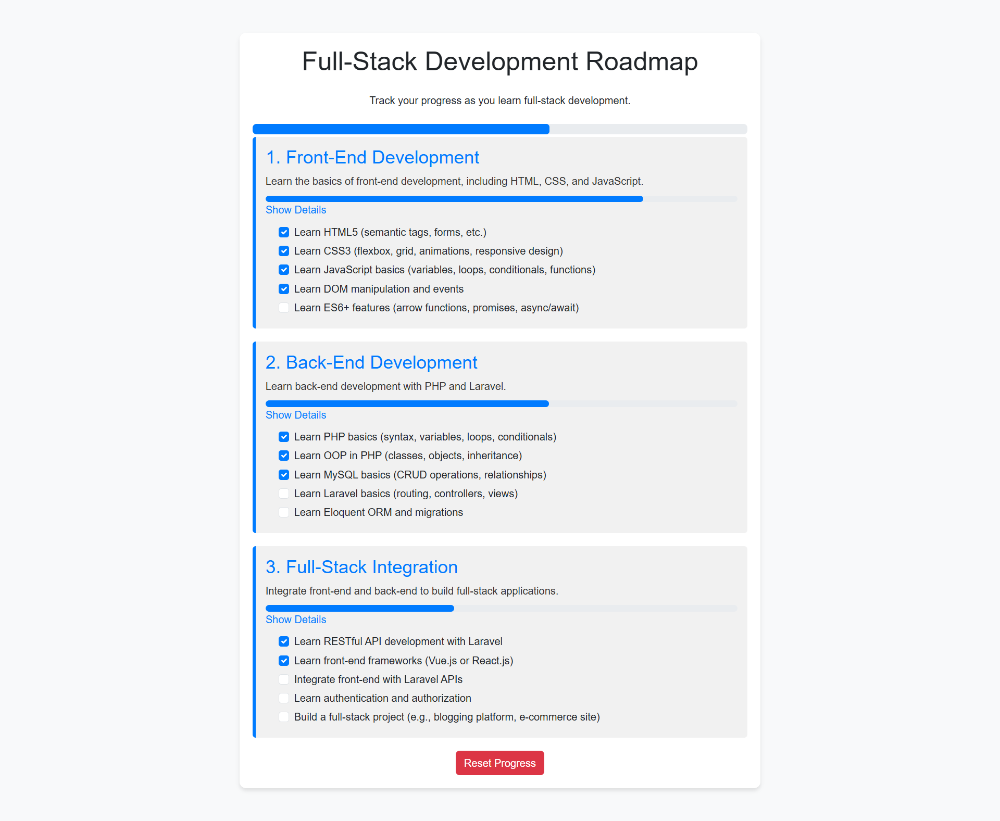

# Full-Stack Development Roadmap 🚀

 <!-- Add a screenshot of your project here -->

## 📝 Description

The **Full-Stack Development Roadmap** is an interactive and detailed guide to help you track your progress as you learn full-stack development. It includes **granular sub-steps** for each phase of learning, such as HTML, CSS, JavaScript, PHP, Laravel, and more. Each step has a **checkbox** to mark your progress, and the roadmap dynamically updates **progress bars** for individual phases and overall completion.

This project is perfect for beginners and intermediate learners who want a structured and visual way to track their full-stack development journey.

---

## ✨ Features

- **Interactive Roadmap**: Track your progress with checkboxes for each step.
- **Granular Sub-Steps**: Detailed breakdown of each phase (e.g., HTML tags, CSS properties, JavaScript concepts).
- **Progress Bars**: Visual progress indicators for each phase and overall completion.
- **Local Storage**: Save your progress locally in the browser.
- **Responsive Design**: Works seamlessly on all devices.
- **Reset Button**: Clear all progress and start over.

---

## 🛠️ How to Use

1. **Open the Roadmap**: Simply open the `index.html` file in your browser.
2. **Mark Your Progress**: Click the checkboxes to mark completed steps.
3. **Track Progress**: Watch the progress bars update in real-time.
4. **Reset Progress**: Use the "Reset Progress" button to clear all checkboxes and start fresh.

---

## 🚀 Technologies Used

- **HTML5**: For structuring the roadmap.
- **CSS3**: For styling and responsive design.
- **Bootstrap 5**: For pre-built components and utilities.
- **JavaScript**: For interactivity and progress tracking.
- **Local Storage**: For saving progress in the browser.

---

## 🛠️ Installation

1. **Clone the Repository**:
   ```bash
   git clone https://github.com/your-username/full-stack-roadmap.git
